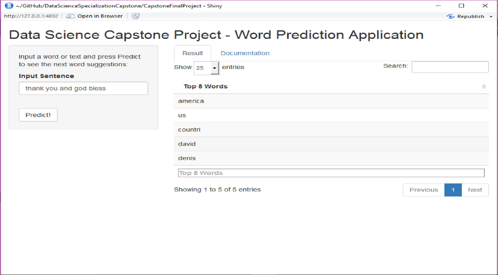

Word Suggestion - Data Science Capstone Project
========================================================
author: Sairam Praneeth Vegesana
date: March 2017
transition: fade
transition-speed: slow

<h2 style="color:Orange">Data Science Specialization Capstone Project</h2>

Application Summary
========================================================

<b> This is a basic summary of the Capstone Project which is the Final Project of the Data Science Specialization Course.</b>

<blockquote style = "font-size:20pt">
The Main Objective of this application is to predict the next word in a sentence provided by the user along with ensuring that the predicted words are relevant to the context of the user sentence. the Datasets used for building this model were derived from the twitter, news and blogs datasets of the Swiftkey Dataset provided by coursera. After sampling 1% of each dataset, combining them, cleaning the final combined model, (Trigram,Unigram), (Bigram,Unigram) and (Unigram,Unigram) pairs were generated from the dataset. Each of these pairs are stored in three seperate data frames and are utilized for the next word prediction using the basic backoff algorithm. The techniques utilized in this project were altered to suit the application in terms of performance.
</blockquote>

Application Functionality
========================================================
incremental: true

<h4>Type a sentence into the text box and click on Predict to retrieve the Top 5 Next Word Suggestions</h4>

<h4>The Next Word is predicted using the following steps:</h4>

<ol style="line-height:20px;font-size:15pt">
<li><b>The (Trigram,Unigram), (Bigram,Unigram) and (Unigram,Unigram) Data Frames are loaded into the application.</b></li>
<li>The Input Sentence is provided by the user.</li>
<li>The input sentence is cleaned by striping the excess white spaces, converting to lower case and the last (3/2/1) tokens are taken.</li>
<li>The prediction algorithm uses a simple backoff algorithm without using weights to deteremine which N-Gram Dataframe should be used. The following is how the word suggestions are derived:
  <ul style = "width:100%">
  <li>if the number of tokens are 3, search in the (Trigram,Unigram) Dataframe. if result found, return the top 5 suggestions. if No result found or number of tokens less than 3, then:</li>
  <li>if the number of tokens are 2, search in the (Bigram,Unigram) Dataframe. if result found, return the top 5 suggestions. if No result found or number of tokens less than 2, then:</li>
  <li>Search in the (Unigram,Unigram) Dataframe and return the top 5 suggestions</li>
  </ul>
</li>
</ol>

Application Examples
========================================================

<h4>The following suggestions have been generated for the following 5 examples:</h4>

<ol>
  <li>"wish you a happy new" : Suggested Word = "year"</li>
  <li>"have a good" : Suggested Word = "morning"</li>
  <li>"we wish you a merry" : Suggested Word = "christmas"</li>
  <li>"do not bring" : Suggested Word = "back"</li>
  <li>"thank you and god bless" : Suggested Word = "america"</li>
</ol>

Application Examples
========================================================

<ol>
  <li><a href="https://sairampraneeth.shinyapps.io/CapstoneFinalProject/">Link to the Application hosted on Shiny IO</a></li>
  <li><a href="https://github.com/sairampraneeth/DataScienceSpecializationFinalCapstoneProject">The Github Link to the Capstone Project</a></li>
  <li>Thank you and have a good day!!</li>
</ol>
